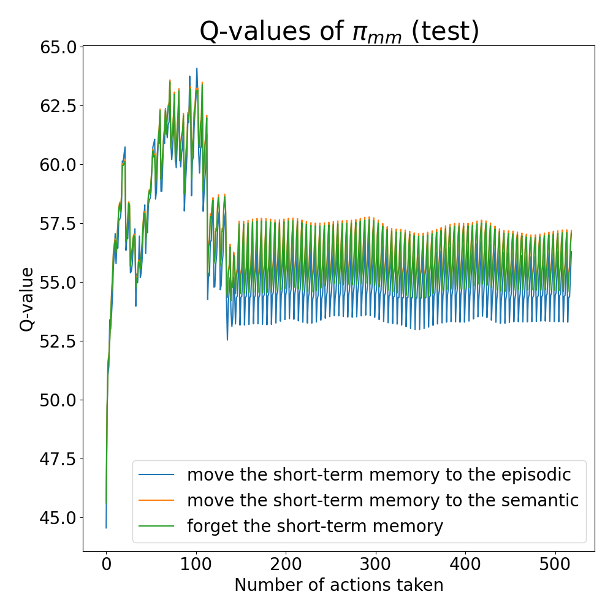

# Agent for RoomEnv-v2

[]()

This repo is to train an agent that interacts with the [RoomEnv-v2](https://github.com/tae898/room-env).

## Prerequisites

1. A unix or unix-like x86 machine
1. python 3.10 or higher.
1. Running in a virtual environment (e.g., conda, virtualenv, etc.) is highly recommended so that you don't mess up with the system python.
1. Make sure you are in the same directory where this README is located, i.e., `AgentRoomEnv2`
1. Install the `explicit_memory` python package, by running `pip install ..`
   1. This will install the gymnasium environment [RoomEnv2](https://github.com/tae898/room-env)
1. `pip install -r requirements.txt`

## Run training

```sh
python train.py
```

The hyperparameters can be configured in [`train.yaml`](./train.yaml). The training results with the
checkpoints will be saved at [`./training_results/`](./training_results/).

## Results

| Comparison of our methods and the baseline |
| :----------------------------------------: |
|            |

| Q-values of memory management policy (test) |    Q-values of explore policy (test)     | Q-values of explore policy (baseline history room size of 24) (test) |
| :-----------------------------------------: | :--------------------------------------: | :------------------------------------------------------------------: |
|          |  |                             |

Also check out [`./trained-agents/`](./trained-agents) to see the saved training results.

## Results

## Contributing

Contributions are what make the open source community such an amazing place to be learn, inspire, and create. Any contributions you make are **greatly appreciated**.

1. Fork the Project
1. Create your Feature Branch (`git checkout -b feature/AmazingFeature`)
1. Run `make test && make style && make quality` in the root repo directory, to ensure code quality.
1. Commit your Changes (`git commit -m 'Add some AmazingFeature'`)
1. Push to the Branch (`git push origin feature/AmazingFeature`)
1. Open a Pull Request

## [Cite our paper]()

```bibtex

```

## Authors

- [Taewoon Kim](https://taewoon.kim/)
- [Michael Cochez](https://www.cochez.nl/)
- [Vincent Francois-Lavet](http://vincent.francois-l.be/)

## License

[MIT](https://choosealicense.com/licenses/mit/)
