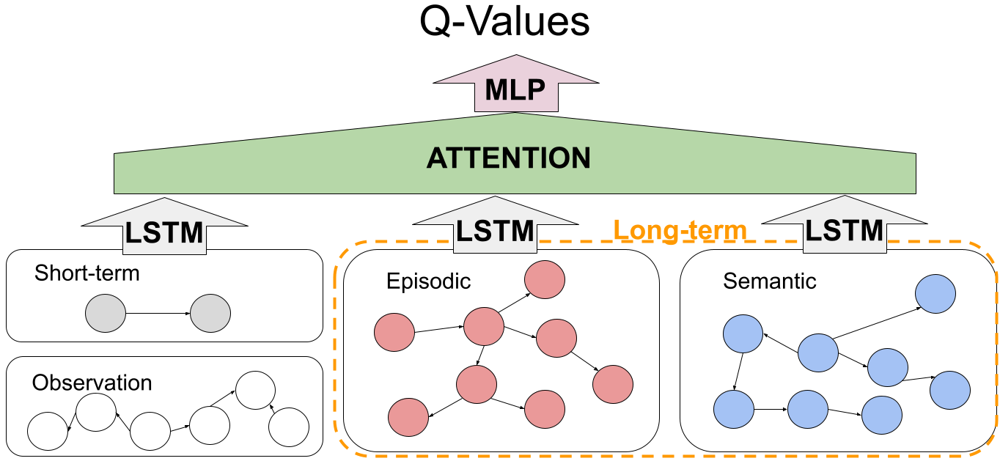
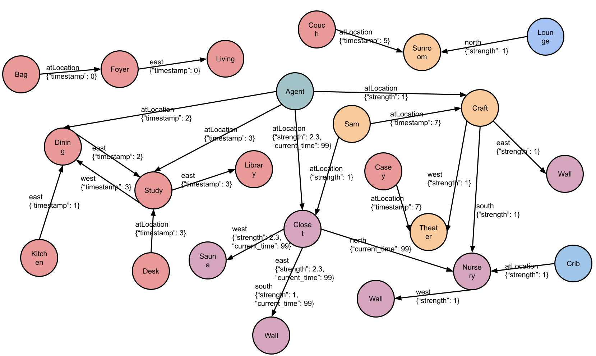

# Agent for RoomEnv-v2

[](https://zenodo.org/doi/10.5281/zenodo.10876433)
[]()

This repo is to train an agent with an LSTM that interacts with the
[RoomEnv-v2](https://github.com/humemai/room-env).

## Prerequisites

1. A unix or unix-like x86 machine
1. python 3.10 or higher.
1. Running in a virtual environment (e.g., conda, virtualenv, etc.) is highly
   recommended so that you don't mess up with the system python.
1. Install the requirements by running `pip install -r requirements.txt`

## Training

- [Jupyter Notebook for training](train-dqn.ipynb)
- The training results are saved at [`./trained-results`](./trained-results/).

## HumemAI Agent

|       The three functions of interest        |                   DQN                    |            Memory Systems Example            |
| :------------------------------------------: | :--------------------------------------: | :------------------------------------------: |
|  |  |  |

## Training Results

| Capacity | Agent Type      | Phase 1   | Phase 2       |
| -------- | --------------- | --------- | ------------- |
| 12       | **HumemAI (E)** | 191 (±42) | **194** (±29) |
|          | HumemAI         | 105 (±37) | 160 (±30)     |
|          | Baseline        | N/A       | 144 (±14)     |
|          | HumemAI (S)     | 111 (±43) | 124 (±65)     |
| 24       | **HumemAI**     | 127 (±26) | **214** (±64) |
|          | HumemAI (E)     | 227 (±21) | 209 (±30)     |
|          | Baseline        | N/A       | 138 (±52)     |
|          | HumemAI (S)     | 98 (±45)  | 112 (±79)     |
| 48       | **HumemAI**     | 118 (±18) | **235** (±37) |
|          | HumemAI (S)     | 192 (±13) | 226 (±97)     |
|          | HumemAI (E)     | 201 (±42) | 225 (±25)     |
|          | Baseline        | N/A       | 200 (±15)     |
| 96       | Baseline        | N/A       | 155 (±77)     |
| 192      | Baseline        | N/A       | 144 (±68)     |

Also check out [`./trained-results/`](./trained-results) to see the saved training
results.

## pdoc documentation

Click on [this link](https://humemai.github.io/agent-room-env-v2-lstm) to see the HTML
rendered docstrings

## Contributing

Contributions are what make the open source community such an amazing place to be learn,
inspire, and create. Any contributions you make are **greatly appreciated**.

1. Fork the Project
1. Create your Feature Branch (`git checkout -b feature/AmazingFeature`)
1. Run `make test && make style && make quality` in the root repo directory, to ensure
   code quality.
1. Commit your Changes (`git commit -m 'Add some AmazingFeature'`)
1. Push to the Branch (`git push origin feature/AmazingFeature`)
1. Open a Pull Request

## [Cite our paper]()

```bibtex

```

## Authors

- [Taewoon Kim](https://taewoon.kim/)
- [Michael Cochez](https://www.cochez.nl/)
- [Vincent Francois-Lavet](http://vincent.francois-l.be/)
