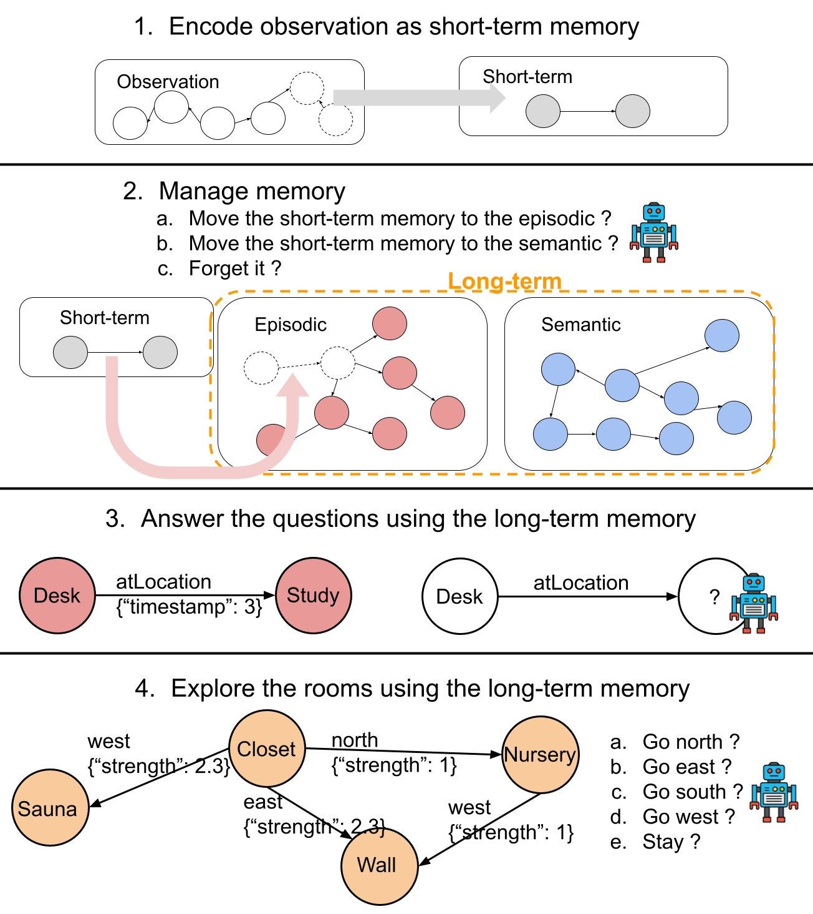

# Agent for RoomEnv-v2

[](https://zenodo.org/doi/10.5281/zenodo.10876433)
[](https://arxiv.org/pdf/2408.05861)

This repo is to train an agent with an LSTM that interacts with the
[RoomEnv-v2](https://github.com/humemai/room-env).

## Prerequisites

1. A unix or unix-like x86 machine
1. python 3.10 or higher.
1. Running in a virtual environment (e.g., conda, virtualenv, etc.) is highly
   recommended so that you don't mess up with the system python.
1. Install the requirements by running `pip install -r requirements.txt`

## Training

- [Jupyter Notebook for training](train-dqn.ipynb)
- The training results are saved at [`./trained-results`](./trained-results/).

## RoomEnv-v2

| An illustration of a hidden state $s_{t}$ (in white) and partial observation $o_{t}$ (in gray). |
| :---------------------------------------------------------------------------------------------: |
|                                                                |

| A hidden state $s_{t}$ (in white) and partial observation $o_{t}$ (in gray) represented as a KG. |
| :----------------------------------------------------------------------------------------------: |
|                                                              |

## HumemAI Agent

| A visualization of the four steps involved in training. |
| :-----------------------------------------------------: |
|                            |

|                   DQN                    |
| :--------------------------------------: |
|  |

| The memory of the agent at the last time step. This is the most likely hidden state captured by the agent. |
| :--------------------------------------------------------------------------------------------------------: |
|                                                                |

## Training Results

| Capacity | Agent Type      | Phase 1       | Phase 2       |
| -------- | --------------- | ------------- | ------------- |
| 12       | HumemAI         | 105 (±37)     | 160 (±30)     |
|          | **HumemAI (E)** | **191 (±42)** | **194 (±29)** |
|          | HumemAI (S)     | 111 (±43)     | 124 (±65)     |
|          | Baseline        | N/A           | 144 (±14)     |
| 24       | **HumemAI**     | **127 (±26)** | **214 (±64)** |
|          | HumemAI (E)     | 227 (±21)     | 209 (±30)     |
|          | HumemAI (S)     | 98 (±45)      | 112 (±79)     |
|          | Baseline        | N/A           | 138 (±52)     |
| 48       | **HumemAI**     | **118 (±18)** | **235 (±37)** |
|          | HumemAI (E)     | 201 (±42)     | 225 (±25)     |
|          | HumemAI (S)     | 192 (±13)     | 226 (±97)     |
|          | Baseline        | N/A           | 200 (±15)     |
| 96       | Baseline        | N/A           | 155 (±77)     |
| 192      | Baseline        | N/A           | 144 (±68)     |

See [`./run-trained-models.ipynb`](./run-trained-models.ipynb) to run the trained
models.

## pdoc documentation

Click on [this link](https://humemai.github.io/agent-room-env-v2-lstm) to see the HTML
rendered docstrings

## Contributing

Contributions are what make the open source community such an amazing place to be learn,
inspire, and create. Any contributions you make are **greatly appreciated**.

1. Fork the Project
1. Create your Feature Branch (`git checkout -b feature/AmazingFeature`)
1. Run `make test && make style && make quality` in the root repo directory, to ensure
   code quality.
1. Commit your Changes (`git commit -m 'Add some AmazingFeature'`)
1. Push to the Branch (`git push origin feature/AmazingFeature`)
1. Open a Pull Request

## [Cite our paper](https://arxiv.org/abs/2408.05861)

```bibtex
@misc{kim2024leveragingknowledgegraphbasedhumanlike,
      title={Leveraging Knowledge Graph-Based Human-Like Memory Systems to Solve Partially Observable Markov Decision Processes},
      author={Taewoon Kim and Vincent François-Lavet and Michael Cochez},
      year={2024},
      eprint={2408.05861},
      archivePrefix={arXiv},
      primaryClass={cs.AI},
      url={https://arxiv.org/abs/2408.05861},
}
```

## Authors

- [Taewoon Kim](https://taewoon.kim/)
- [Michael Cochez](https://www.cochez.nl/)
- [Vincent Francois-Lavet](http://vincent.francois-l.be/)
